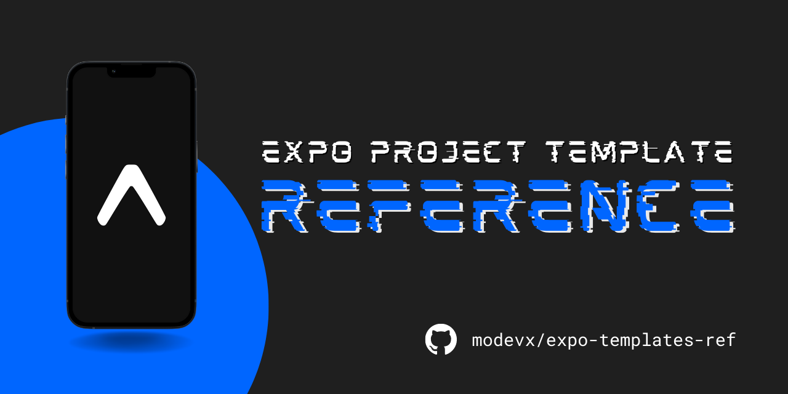

Folder structure outlines and descriptions for Expo's project templates.

- [ ] "bare-minimum" template: `BARE_MINIMUM.md`

```shellscript
expo init --template bare-minimum <project-name>
```

- [ ] "blank" template: `BLANK.md`

```shellscript
expo init --template blank <project-name>
```

- [x] "tabs" template: [`TABS.md`](https://github.com/modevx/expo-templates-ref/blob/main/TABS.md)

```shellscript
expo init --template tabs <project-name>
```

## `expo init` options

|           OPTION            |                         DESCRIPTION                          |
| :-------------------------: | :----------------------------------------------------------: |
| `-t`, `--template` `[name]` |               specify your project's template                |
|           `--npm`           |    if Yarn isn't installed, install dependencies with NPM    |
|          `--yarn`           |               use Yarn to install dependencies               |
|       `--no-install`        |                   skip installing packages                   |
|       `--name [name]`       |              app name displayed on home screen               |
|           `--yes`           | use default options (same as `expo init . --template black`) |
